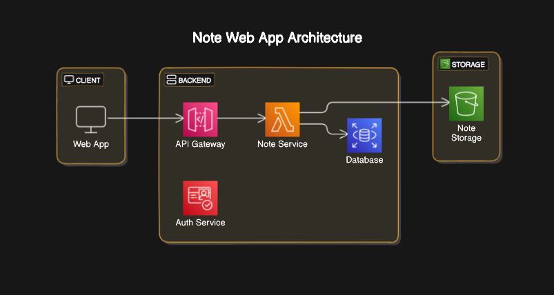

# RESTful API System Design for Note Web Application

## 1. High-Level Design

### Main Components

1. **Frontend (Client):**
   - Framework: React
   - Responsibilities: User interface, data input handling, sending HTTP requests to the backend, and updating the UI with received data.

2. **Backend (Server):**
   - Framework: Spring Boot
   - Responsibilities: Processing HTTP requests, business logic, data handling, interacting with the database, and responding to the frontend with data or status.

3. **Database:**
   - Type: SQL (PostgreSQL)
   - Responsibilities: Persistent data storage, executing queries, and updating note data.

### Logical Interactions

1. **User Interacts with the Frontend:**
   - The user accesses the application interface through a web browser.
   - The user can write a new note, save the note, view a list of saved notes, and delete existing notes.

2. **Frontend Sends Request to Backend:**
   - When the user saves a new note, the frontend sends an HTTP POST request to the backend containing the note's content.
   - To view the list of notes, the frontend sends an HTTP GET request to the backend.
   - To delete a note, the frontend sends an HTTP DELETE request to the backend with the note's ID.

3. **Backend Processes the Request:**
   - The backend validates the user's session to ensure the user is authenticated.
   - The backend processes the necessary business logic (e.g., checking if the note is not empty, checking user permissions, etc.).
   - The backend interacts with the database to save, retrieve, or delete notes.

4. **Database Stores and Retrieves Notes:**
   - Notes are stored in a table in the database.
   - The database responds to the backend's queries with the requested note data.

5. **Backend Responds to Frontend:**
   - The backend sends an HTTP response to the frontend containing the note data (for GET), success confirmation (for POST), or deletion confirmation (for DELETE).

6. **Frontend Updates the Interface:**
   - The frontend updates the user interface based on the received responses (e.g., displays the updated list of notes, confirms note saving or deletion).

### High-Level Architecture Diagram



## 2. Web Application UI

### Wireframe Design

<!--  -->

### UI Components

- **Note Form:**
  - Text input area
  - Save button
- **Note List:**
  - Display of saved notes with delete buttons

### Necessary Validations

- **Input Validation:**
  - Check if the note is not empty before saving.
- **User Session:**
  - Check if the user is logged in before allowing operations.

## 3. Data Model

### Note Structure

```json
{
  "id": "string",
  "userId": "string",
  "content": "string",
  "timestamp": "string"
}
````
## Property Descriptions

- **id:** Unique identifier for the note.
- **userId:**  Identifier of the user who created the note.
- **content:** Text of the note.
- **timestamp:** Date and time when the note was created or modified.

## RESTful API

### Necessary Endpoints

1. **GET /notes:** Returns all user notes.

   **Request:** `GET /notes?userId={userId}`

   **Response:**
   ```json
   [
     {
        "id": "1",
        "userId": "user123",
        "content": "My first note",
        "timestamp": "2024-06-08T12:00:00Z"
     },
     ...
   ]
   ````

2. **POST /notes:** Creates a new note.

   **Request:** `POST /notes`
   ```json
   {
     "userId": "user123",
     "content": "My new note"
   }
   ````
 **Response:**
 ```json
    {
    "id": "2",
    "userId": "user123",
    "content": "My new note",
    "timestamp": "2024-06-08T12:05:00Z"
    }
 ```
3. **DELETE /notes/{id}:** Deletes a note by ID.

    **Request:** DELETE /notes/1

    Response:

    ```json
    {
    "message": "Note successfully deleted"
    }

    ````

## Web Server

### Implementation of the RESTful API

#### GET /notes

- **Action:**
- Retrieve all notes from the database for the logged-in user.
- **Business Logic:**
- Verify the user's session.
- **Database:**
- Execute a query to retrieve the user's notes.

#### POST /notes

- **Action:**
- Save a new note to the database.
- **Business Logic:**
- Verify the user's session and validate the note's content.
- **Database:**
- Insert the new note into the database.

#### DELETE /notes/{id}

- **Action:**
- Delete a note by ID.
- **Business Logic:**
- Verify the user's session and ensure the ID belongs to the user.
- **Database:**
- Execute a deletion of the note with the provided ID.
